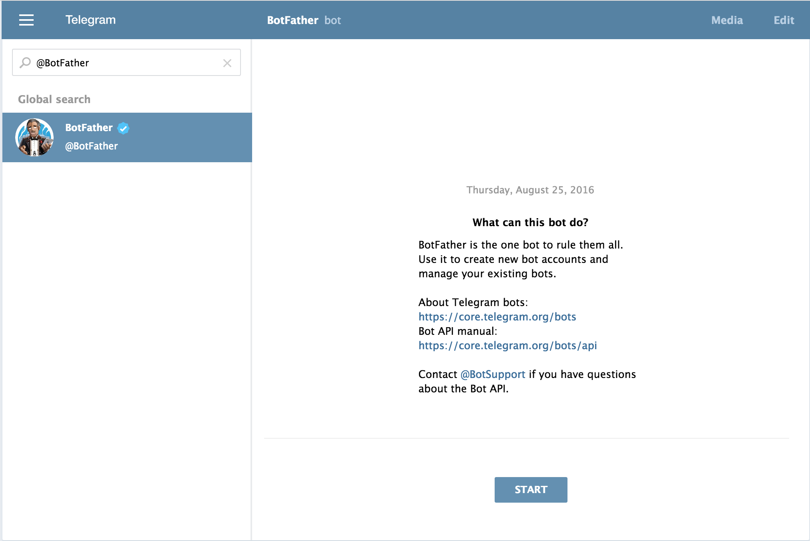
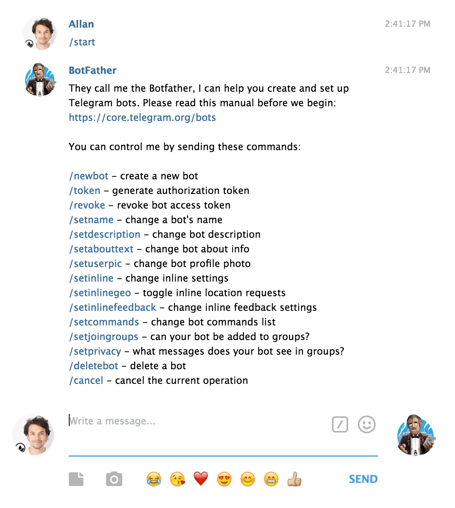
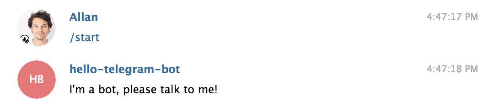
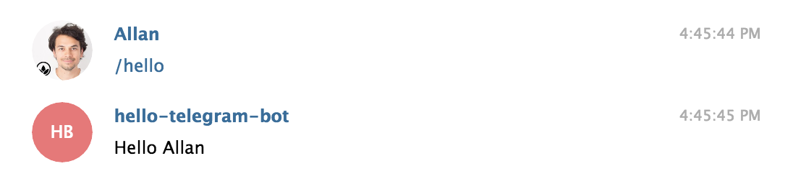
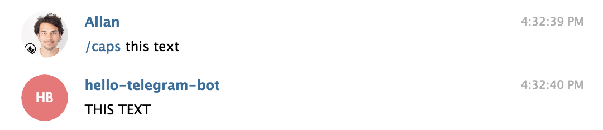
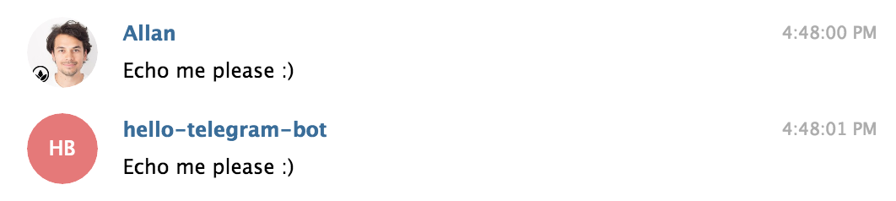

# Creating a Telegram Bot

Let's get started! In this tutorial we'll use the Python library provided by Telegram called [python-telegram-bot](https://github.com/python-telegram-bot/).

1. Fire up a command line and install the required libraries through your command line by running:

	`pip install -r requirements.txt`

2. Create or sign in to your [Telegram Account](https://web.telegram.org/)

3. Search for `@BotFather`

	

4. Initialize a conversation with the `@BotFather`

	
	
5. Create a new bot by typing `/newbot` and follow the guided process.

	Congratulations, you've created your Telegram Bot :) 

6. Generate an access token which you'll need to communicate with your bot by typing `/token`

7. Replace your Telegram access token in `telegram.py`

8. Then import `telegram.py` via `import telegram` at the top of your `main.py`

9. Your Bot supports following things:
	* /start
	
	* /hello
	
	* /caps your text
	
	* Echoes messages
	

## Notes

Add `@Hello_Telegram_Bot` and send him a message to test the features in this tutorial.

Find more infos and documentation about `python-telegram-bot` at [https://github.com/python-telegram-bot/](https://github.com/python-telegram-bot/)

### Examples by `python-telegram-bot`

Get inspired by more [Examples](https://github.com/python-telegram-bot/python-telegram-bot/tree/master/examples) here:

**[`echobot2.py`](https://github.com/python-telegram-bot/python-telegram-bot/blob/master/examples/echobot2.py)**

This is probably the base for most of the bots made with `python-telegram-bot`. It simply replies to each text message with a message that contains the same text.

**[`timerbot.py`](https://github.com/python-telegram-bot/python-telegram-bot/blob/master/examples/timerbot.py)**

This bot uses the [`JobQueue`](https://pythonhosted.org/python-telegram-bot/telegram.ext.jobqueue.html) class to send timed messages. The user sets a timer by using `/set` command with a specific time, for example `/set 30`. The bot then sets up a job to send a message to that user after 30 seconds. The user can also cancel the timer by sending `/unset`. To learn more about the `JobQueue`, read [this wiki article](https://github.com/python-telegram-bot/python-telegram-bot/wiki/Extensions-%E2%80%93-JobQueue).

**[`conversationbot.py`](https://github.com/python-telegram-bot/python-telegram-bot/blob/master/examples/conversationbot.py)**

A common task for a bot is to ask information from the user. In v5.0 of this library, we introduced the [`ConversationHandler`](https://pythonhosted.org/python-telegram-bot/telegram.ext.conversationhandler.html) for that exact purpose. This example uses it to retrieve user-information in a conversation-like style.

**[`inlinekeyboard.py`](https://github.com/python-telegram-bot/python-telegram-bot/blob/master/examples/inlinekeyboard.py)**

This example sheds some light on inline keyboards, callback queries and message editing.

**[`inlinebot.py`](https://github.com/python-telegram-bot/python-telegram-bot/blob/master/examples/inlinebot.py)**

A basic example of an [inline bot](https://core.telegram.org/bots/inline). Don't forget to enable inline mode with [@BotFather](https://telegram.me/BotFather).